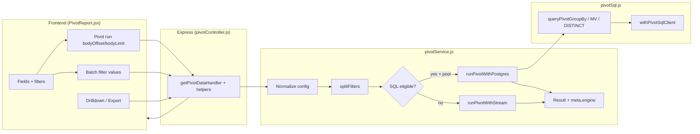

# Excel Import and Reporting Platform

Production-focused full-stack system for importing Excel sales files, enriching data with master mappings, storing records in `sales_data`, and serving fast Data-tab and Pivot-tab APIs for large datasets.

## What This Project Does

This project is built for operational sales reporting where users need to:

- upload Excel sales files
- monitor import progress and errors
- browse imported rows in a paginated data table
- analyze data in an Excel-style pivot report
- edit selected admin master tables

The application is designed so heavy work happens on the backend, while the frontend remains responsive through pagination, caching, lazy loading, and virtualization.

## Tech Stack

- Frontend: React
- Backend: Node.js + Express
- Database: PostgreSQL
- Data access: Supabase client + direct PostgreSQL pool
- Import processing: ExcelJS, fast-csv, PostgreSQL `COPY`
- Pivot rendering: backend aggregation + `react-window` virtualization

## Table of contents

1. [Main application sections](#main-application-sections)
2. [Project structure and file inventory](#project-structure-and-file-inventory)
3. [Excel headers → database columns](#excel-headers--database-columns-import-mapping)
4. [Reference tables, masters, and enrichment](#reference-tables-masters-and-enrichment)
5. [SQL files in this repository](#sql-files-in-this-repository)
6. [Backend HTTP routes (mount points)](#backend-http-routes-mount-points)
7. [End-to-end data flow](#end-to-end-data-flow)
8. [Report tab (Pivot)](#report-tab-pivot-architecture-and-data-flow)
9. [API summary](#api-summary)
10. [Database and performance](#database-and-performance-design)
11. [Setup and scripts](#setup)
12. [Further documentation](#further-documentation)

## Main Application Sections

### 1. Login

- Entry file: `frontend/src/App.jsx`
- Login page: `frontend/src/pages/Login.jsx`
- API client: `frontend/src/services/api.js` -> `authApi.login`
- Behavior:
  - stores session in local storage (`auth_session`)
  - shows `Dashboard` after successful login
  - logs out automatically after 15 minutes of inactivity

### 2. Import

- UI container: `frontend/src/pages/Dashboard.jsx`
- Upload component: `frontend/src/components/FileUpload.jsx`
- Progress component: `frontend/src/components/ImportProgress.jsx`
- History component: `frontend/src/components/ImportHistory.jsx`
- Backend routes: `backend/routes/import.js`
- Backend controller: `backend/controllers/importController.js`
- Main backend processing service: `backend/services/excelProcessor.js`

### 3. Data Tab

- UI entry: `frontend/src/pages/Dashboard.jsx`
- Main table: `frontend/src/components/VirtualizedTable.jsx`
- API route: `GET /api/data`
- Backend controller: `backend/controllers/dataController.js`
- Purpose:
  - server-side paginated browsing of `sales_data`
  - filtered and enriched row display
  - periodic refresh while imports are active

### 4. Pivot / Report Tab

- UI component: `frontend/src/components/pivot/PivotReport.jsx`
- API client: `frontend/src/services/api.js` (`pivotApi`: fields, filter values, batch filter values, run, drilldown, export)
- Route file: `backend/routes/data.js` (mounts under `/api/data`)
- Controller: `backend/controllers/pivotController.js` (pivot body windowing, serialization, export)
- Services:
  - `backend/services/pivotService.js` — orchestration, filter split, Postgres vs stream engine, caches
  - `backend/services/pivotSql.js` — SQL `GROUP BY`, MV shortcuts, DISTINCT filters, drilldown SQL
  - `backend/services/pivotBodyOrder.js` — slice pivot body rows for UI paging without changing grand totals
  - `backend/services/pivotRedisCache.js` — optional Redis for pivot payloads and filter lists
- Purpose:
  - server-side aggregation over `sales_data` (not in-browser pivot)
  - filters, drilldown, CSV/XLSX export, virtualized grid, progressive body loading

For a full walkthrough of the current data flow and recent behavior, see **[Report tab (Pivot): architecture and data flow](#report-tab-pivot-architecture-and-data-flow)** below.

### 5. Admin Tab

- UI component: `frontend/src/components/AdminSOUpload.jsx`
- Purpose:
  - upload SO master files
  - preview/edit master tables
  - view row edit history

## Project structure and file inventory

### Frontend (`frontend/`)

| Path | Role |
|------|------|
| `package.json` | React/Vite app scripts (`dev`, `build`); dependencies (`react`, `react-window`, `lucide-react`, `axios`, `xlsx`, `tailwind`). |
| `vite.config.js` | Dev server **port 3000**; proxies `/api` → `http://localhost:5002` (adjust if your backend `PORT` differs). Long timeouts for large uploads. |
| `tailwind.config.js` | Tailwind CSS configuration. |
| `src/main.jsx` | React root mount. |
| `src/App.jsx` | Shell: auth session, tab routing after login, **15 min inactivity logout**. |
| `src/pages/Login.jsx` | Login form → `POST /api/auth/login`. |
| `src/pages/Dashboard.jsx` | Tabs: Import, Data, Report (Pivot), Admin; wires `VirtualizedTable`, `PivotReport`, `FileUpload`, etc. |
| `src/services/api.js` | **Single API layer**: `authApi`, `importApi`, `dataApi`, `historyApi`, `pivotApi`, `adminApi` (axios instances, timeouts, filter-value caching). |
| `src/constants/timing.js` | Axios / UI timeouts (pivot body vs filter DISTINCT vs default). |
| `src/constants/limits.js` | `MAX_SALES_ROWS` alignment with backend. |
| `src/utils/requestError.js` | User-facing error formatting. |
| `src/utils/supabaseClient.js` | Browser Supabase client (if used for direct reads). |
| `src/utils/salesTableCellFormat.js` | Data grid cell formatting. |
| `src/hooks/usePersistentState.js` | localStorage-backed React state. |
| `src/hooks/usePageVisibility.js` | Page visibility (pause polling when tab hidden). |
| `src/components/FileUpload.jsx` | Excel upload → `POST /api/import`. |
| `src/components/UploadOverlay.jsx` | Blocks UI during upload. |
| `src/components/ImportProgress.jsx` | Polls `GET /api/import/status/:jobId`. |
| `src/components/ImportHistory.jsx` | Lists jobs via history API. |
| `src/components/ImportToast.jsx` | Toast notifications. |
| `src/components/VirtualizedTable.jsx` | **Data tab**: virtualized rows, `dataApi.fetch`. |
| `src/components/VirtualizedTableRow.jsx` | Row renderer. |
| `src/components/DeleteByDate.jsx` | Bulk delete by date range UI. |
| `src/components/Sidebar.jsx` | Navigation. |
| `src/components/AdminSOUpload.jsx` | **Admin**: SO master upload, master table preview/edit/history. |
| `src/components/AppErrorBoundary.jsx` | React error boundary. |
| `src/components/pivot/PivotReport.jsx` | **Report tab**: field wells, filters, `pivotApi`, `react-window`, body paging merge, debounced filter runs (~1.1s), export. |

### Backend (`backend/`)

| Area | Contents |
|------|----------|
| `server.js` | Express app: CORS, compression, JSON body, **rate limit**, mounts `/api/import`, `/api/data`, `/api/history`, `/api/auth`, `/api/admin`; serves `frontend/dist` in production; optional pivot filter cache preload. |
| `routes/import.js` | Upload, status, cancel, resume, **template** download. |
| `routes/data.js` | Data list, states, filters, delete-range, **all pivot/report** endpoints. |
| `routes/history.js` | Import history list, failed-rows download. |
| `routes/auth.js` | `POST /login`. |
| `routes/admin.js` | SO master + generic master table admin APIs. |
| `controllers/` | `importController`, `dataController`, `pivotController`, `reportController`, `historyController`, `authController`, `adminController`. |
| `services/` | `excelProcessor`, `salesCopyInserter`, `import/*` (CSV shards, enrichment), `pivotService`, `pivotSql`, `pivotBodyOrder`, `pivotRedisCache`, `masterLoaders`, `reportMetaService`, etc. |
| `repositories/` | e.g. `reportRepository.js` — DB access helpers. |
| `queries/` | e.g. `authQueries.js`. |
| `config/` | `database.js` (pg pool), `constants.js` (**required Excel headers**, aliases, import rules). |
| `models/` | `schema.sql`, `supabase.js` (server Supabase client). |
| `utils/` | `logger`, `salesFacts`, `normalizeHeader`, `customerTypeMaster`, etc. |
| `uploads/` | Staged uploads and temp CSV shards during import. |

### Root (`Excel_Project/`)

| File | Role |
|------|------|
| `package.json` | **`concurrently`**: runs backend + frontend (`npm run dev`). Also `build`, `start`, `db:migrate`. |

## Excel headers → database columns (import mapping)

Canonical **required** Excel headers live in `backend/config/constants.js` (`REQUIRED_HEADERS`). The importer normalizes headers (case, spacing, aliases) then maps each logical column to a **`sales_data`** column. The database schema documents the same mapping in the header comment of `backend/models/schema.sql`.

Summary (Excel → `sales_data`):

| Excel (logical) | `sales_data` column |
|-----------------|---------------------|
| BRANCH | `branch` |
| FY | `fy` |
| MONTH | `month` |
| MMM | `mmm` |
| REGION | `region` (often **derived** at import from state + `region_master` / `ref_states` + `ref_regions`, not from Excel) |
| STATE | `state` |
| DISTRICT | `district` |
| CITY | `city` |
| TYPE OF Business | `business_type` |
| Agent Names Correction | `agent_names_correction` |
| PARTY GROUPED | `party_grouped` |
| PARTY NAME FOR COUNT | `party_name_for_count` |
| BRAND | `brand` |
| AGENT NAME | `agent_name` |
| TO PARTY NAME | `to_party_name` |
| BILL NO. | `bill_no` |
| BILL Date | `bill_date` |
| ITEM NAME | `item_no` |
| SHADE NAME | `shade_name` |
| RATE/UNIT | `rate_unit` |
| SIZE | `size` |
| UNITS/PACK | `units_pack` |
| SL QTY | `sl_qty` |
| GROSS AMOUNT | `gross_amount` |
| AMOUNT BEFORE TAX | `amount_before_tax` |
| NET AMOUNT | `net_amount` |
| SALE ORDER NO. | `sale_order_no` |
| SALE ORDER Date | `sale_order_date` |
| Item with Shade | `item_with_shade` |
| Item Category | `item_category` |
| Item Sub cat | `item_sub_cat` |
| SO TYPE | `so_type` |
| SCHEME | `scheme` |
| GOODS TYPE | `goods_type` |
| AGENT NAME. | `agent_name_final` |
| PIN CODE | `pin_code` |

**Aliases:** Many alternate spellings map onto the same logical header (e.g. `NET AMT` → `NET AMOUNT`, `ITEM NO` → `ITEM NAME`). See `HEADER_ALIASES` and related maps in `backend/config/constants.js`.

**Row rules:** `SKIP_ROWS`, `SKIP_COLUMN_A`, `SKIP_LAST_DATA_ROW`, grand-total detection — see `constants.js` and `excelProcessor.js`.

## Reference tables, masters, and enrichment

- **`sales_data`** stores **denormalized text** facts (fast `COPY`). It does **not** use foreign keys to `ref_*` tables in the main design.
- **`ref_*` tables** (`ref_regions`, `ref_states`, `ref_branches`, `ref_districts`, `ref_cities`, `ref_business_types`, `ref_brands`, `ref_agents`, `ref_parties`, `ref_items`, `ref_item_categories`) hold **master lists** and hierarchies for dropdowns and optional validation. The view **`region_master`** is defined in `schema.sql` as `ref_states` ⨝ `ref_regions` for **state → region**.
- **Import enrichment** (`enrichImportFactRow`, `importEnrichFactRow.js`, masters snapshot): joins in memory / lookups from **`agent_name_master`**, **`party_grouping_master`**, **`customer_type_master`**, **`so_master`**, **`region_master`** / ref tables, etc., to fill derived fields (e.g. agent display names, party grouping, business type, SO type, region from state).
- **Pivot** may re-read masters for display (`masterLoaders.js`, agent name enrichment on streamed pages).

## SQL files in this repository

There is **1** SQL file tracked under `backend/`:

| # | File | Purpose |
|---|------|---------|
| 1 | `backend/models/schema.sql` | **Source of truth**: `sales_data`, `ref_*`, masters, `import_jobs`, RLS policies, views (`region_master`, `v_distinct_states`), indexes. Applied by `npm run db:migrate` (`scripts/migrate.js`). |

**How they are applied**

- **`schema.sql`**: `cd backend && npm run db:migrate` (requires `DATABASE_URL`).
- All indexes, constraints, MVs, and maintenance-ready DDL are centralized in this file.

## Backend HTTP routes (mount points)

| Mount | File | Examples |
|-------|------|----------|
| `/api/import` | `routes/import.js` | `POST /` upload, `GET /status/:jobId`, `POST /cancel/:jobId`, `POST /resume/:jobId`, `GET /template` |
| `/api/data` | `routes/data.js` | `GET /` data page, `GET /report/fields`, `POST /report/pivot`, … |
| `/api/history` | `routes/history.js` | `GET /` import history, `GET /:jobId/failed-rows` |
| `/api/auth` | `routes/auth.js` | `POST /login` |
| `/api/admin` | `routes/admin.js` | SO master + master-table CRUD/history |

Default **backend** port is **`process.env.PORT || 5001`** in `server.js`. **Vite** defaults to proxying `/api` to port **5002** in `frontend/vite.config.js` — align ports or change the proxy to match your backend.

## End-to-End Data Flow

High-level flow:

`Excel file -> frontend upload -> backend queue/process -> enrich rows -> write to sales_data -> paginated data API / pivot API -> React UI`

### A. Import Data Flow

This is how an Excel file becomes rows in `sales_data`.

#### Frontend import flow

1. User selects Excel file in `frontend/src/components/FileUpload.jsx`
2. Frontend calls `importApi.upload`
3. API endpoint used: `POST /api/import`
4. Backend returns `jobId`
5. Frontend polls status using:
   - `GET /api/import/status/:jobId`
6. `Dashboard.jsx` shows:
   - upload overlay
   - import progress
   - import history

#### Backend import flow

Main methods and files:

- route: `backend/routes/import.js`
- controller: `backend/controllers/importController.js`
- processor: `backend/services/excelProcessor.js`

Main processing path:

1. File is received and stored in `backend/uploads/`
2. `processExcelFile(...)` creates an `import_jobs` record and returns `jobId`
3. Work is queued asynchronously
4. Worker calls `runQueuedImportJob(job)`
5. Master data is loaded once using `loadImportMastersSnapshot()`
6. Excel is streamed using ExcelJS
7. Rows are validated and converted into CSV shard files under temp upload folders
8. CSV shards are parsed in parallel with `@fast-csv/parse`
9. Each row is enriched using `enrichImportFactRow`
10. Rows are inserted into `sales_data` using PostgreSQL `COPY`
11. Status is updated in `import_jobs`
12. Import errors go to `import_errors`
13. Temp files are deleted and job is marked completed

#### Import-related tables

- `sales_data`: final fact table
- `import_jobs`: progress, status, checkpoints
- `import_errors`: failed/skipped rows
- master tables: read once for enrichment during import

## How Data Tab Loads and Shows Data

The Data tab never loads the full dataset into the browser. It always loads one page from the backend.

### Frontend data-tab flow

Main files:

- `frontend/src/pages/Dashboard.jsx`
- `frontend/src/components/VirtualizedTable.jsx`
- `frontend/src/services/api.js`

Behavior:

1. Dashboard renders `VirtualizedTable`
2. Table calls `dataApi.fetch(...)`
3. API endpoint used: `GET /api/data`
4. Current page, limit, sort, and filters are sent as query params
5. Previous in-flight request is aborted if user changes page quickly
6. Returned rows are rendered using virtualization

Important rendering method:

- `VirtualizedTable.jsx` uses row virtualization so only visible rows are mounted in the DOM

### Backend data-tab flow

Main file:

- `backend/controllers/dataController.js`

Main method:

- `getData(req, res)`

What `getData` does:

1. reads query params (`page`, `limit`, `search`, `state`, `sortBy`, `sortOrder`)
2. validates and clamps safe limits
3. builds a filtered DB query on `sales_data`
4. runs count logic when required
5. fetches only the requested page
6. enriches rows in one pass using `enrichRowsSinglePass(...)`
7. returns `{ data, pagination }`

How filters are applied in Data tab:

- frontend sends filter/search values to `GET /api/data`
- backend applies DB-side filtering first
- enrichment runs after fetch
- response is paginated and returned

Supporting endpoints:

- `GET /api/data/states`
- `GET /api/data/filter-options`
- `POST /api/data/delete-range/preview`
- `DELETE /api/data/delete-range`

## Report tab (Pivot): architecture and data flow

The **Report** tab is an Excel-style pivot over the `sales_data` fact table. **Aggregation runs on the server** (PostgreSQL `GROUP BY` when eligible, or a streaming scan fallback). The browser only renders headers, cells, and totals returned as JSON.

### Design goals (current)

- Keep pivot **SQL-first** when `DATABASE_URL` is configured and filters/measures are eligible.
- Support **very large** fact tables without loading all rows into the browser.
- **Page the pivot body** (row axis) in chunks while keeping **grand totals** based on the full result.
- Load filter dropdowns efficiently (batch API, caching, bounded concurrency on the server).
- Optional **Redis** caching for repeat identical pivot configs and filter lists.

### HTTP endpoints (Report / pivot)

| Method | Path | Role |
|--------|------|------|
| `GET` | `/api/data/report/fields` | Field metadata for the field list (rows/columns/values/filters). |
| `GET` | `/api/data/report/filter-values` | DISTINCT values for one filter field (search + limit). |
| `POST` | `/api/data/report/filter-values-batch` | DISTINCT values for many fields in one request (UI batches active filters). |
| `POST` | `/api/data/report/pivot` | Run pivot; optional `bodyOffset` / `bodyLimit` / `subtotalFields` for UI paging. |
| `POST` | `/api/data/report/drilldown` | Detail rows for a cell (`rowKey`, `columnKey`, paging). |
| `POST` | `/api/data/report/export` | Full pivot rerun (no body window) → CSV or XLSX. |
| `GET` | `/api/data/pivot` | Lightweight preset pivot for quick charts/links (`getPivotQuickHandler`). |

Routes are registered in `backend/routes/data.js` and mounted as `/api/data/...` from the main app.

### End-to-end data flow (summary)



### Frontend flow (`PivotReport.jsx`, `api.js`)

1. **Fields** — On load, `pivotApi.fields()` → `GET /api/data/report/fields`. The UI builds drag targets for dimensions and measures.
2. **Filter values** — For each active filter field, the UI prefers **`pivotApi.filterValuesBatch`** → `POST /api/data/report/filter-values-batch` to avoid N sequential round-trips. Single-field `filterValues` still exists for one-off loads. Client-side caching (TTL) in `api.js` avoids refetching the same field/search/limit.
3. **Running the pivot** — When layout or filters change (debounced), the UI calls `pivotApi.run` with the full pivot config plus **body paging**:
   - `bodyOffset`, `bodyLimit` (e.g. first page only).
   - Optional `subtotalFields` for subtotal rows aligned to the row hierarchy.
4. **Scroll / load more** — Additional body chunks use the same `POST /api/data/report/pivot` with increasing `bodyOffset`; **column headers, totals, and grand totals** come from the server; only the **body line list** is windowed server-side via `applyPivotBodyOrder` in the controller.
5. **Rendering** — `buildPivotLayout` + **`react-window`** virtualize visible body rows so the DOM stays small.
6. **Drilldown** — `pivotApi.drilldown` posts `{ config, drill }` with offset/limit.
7. **Export** — `pivotApi.export` posts the pivot config (body window params stripped on the server) and receives a file blob.

**Timeouts** — Fast vs long axios budgets live in `frontend/src/constants/timing.js` (e.g. general UI vs pivot body vs filter DISTINCT). Keep filter DISTINCT timeout ≥ server `PIVOT_FILTER_SQL_TIMEOUT_MS` so the browser does not abort first.

### Backend controller (`pivotController.js`)

- **`getPivotDataHandler`** — Parses optional **`bodyOffset` / `bodyLimit` / `subtotalFields`** from the JSON body, calls `runPivot(config)`, then **`applyPivotBodyWindow`** so the response includes a **sliced `bodyLines`** (if requested) while preserving full totals metadata as produced by the service.
- **`exportPivotHandler`** — Strips body-window fields from config, runs full `runPivot`, builds CSV/XLSX via `ExcelJS` for XLSX.
- **Errors** — PostgreSQL **statement timeout** (`57014` / message match) → **504** with `code: PIVOT_TIMEOUT` (message reflects DB-side timeout, not a separate app env for pivot aggregation).

### Backend service (`pivotService.js`)

1. **`normalizeConfig`** — Validates rows, columns, values, filters, sort; aligns with server field lists.
2. **`splitFilters`** — Splits filters into:
   - **`sqlFilters`** — Applied in SQL (Postgres) and/or Supabase stream query.
   - **`memFilters`** — Only when necessary (e.g. no DB pool, or operators that cannot be expressed in SQL for the stream path). When `DATABASE_URL` exists, **blank / not blank / empty equality** are pushed to SQL so the **Postgres pivot path stays enabled** more often.
3. **Engine selection** — `getPivotSqlAggregationDetails(normalized, memFilters)` / `isPivotSqlAggregationEligible` (in `pivotSql.js`):
   - Requires **no `memFilters`**, a **Postgres pool**, row+column dimension count ≤ **`PIVOT_MAX_GROUP_DIMENSIONS`** (default **32** if unset), and supported **measure specs** (sum/count/avg/min/max on numeric fields, etc.).
   - When the engine is **stream**, **`meta.engineReasons`** and **`meta.streamFallbackReason`** explain why (e.g. in-memory filters, no pool, too many dimensions).
4. **`runPivotWithPostgres`** — Calls `queryPivotGroupBy` (and related assembly) to get grouped rows, then builds cell maps, row/column headers, totals, subtotals.
5. **`runPivotWithStream`** — Cursor pages over `sales_data` via Supabase with `sqlFilters`, applies `memFilters` in Node, aggregates in memory (slower on huge data).
6. **Caching** — In-memory LRU for pivot payloads; optional **Redis** (`pivotRedisCache.js`) when `REDIS_URL` / `REDISCLOUD_URL` is set.
7. **`getFilterValuesBatch`** — Runs DISTINCT queries for multiple fields with **bounded concurrency** (`p-queue`, default **5**, overridable via **`PIVOT_FILTER_BATCH_CONCURRENCY`**).
8. **Optional** — `preloadCommonPivotFilterCaches()` warms DISTINCT caches for common fields when **`PIVOT_PRELOAD_FILTER_CACHE=1`**.

### Backend SQL (`pivotSql.js`)

- **`withPivotSqlClient`** — Opens a pooled client, `BEGIN`, sets **`SET LOCAL statement_timeout`** per call:
  - **Pivot aggregation** (`queryPivotGroupBy`, materialized-view paths): timeout is **`0` (disabled)** so the application does not impose its own cap on heavy `GROUP BY` (database or pooler may still enforce limits).
  - **Supporting queries** (DISTINCT filter lists, drilldown SQL): uses **`PIVOT_FILTER_SQL_TIMEOUT_MS`** (default **180000 ms**) unless overridden.
- Optional per-transaction tuning: **`PIVOT_PG_WORK_MEM`**, **`PIVOT_PG_PARALLEL_WORKERS`** (`SET LOCAL`).
- **`queryPivotGroupBy`** — Builds `SELECT … FROM sales_data sd … WHERE … GROUP BY` with `BTRIM`-aligned dimensions and measure expressions aligned with import numeric parsing.
- **Fast paths** — When the layout matches configured materialized views, the query may use a pre-aggregated path first and fall back to live `sales_data` on error. Examples: **`sales_pivot_mv`** (`PIVOT_SOURCE_RELATION`), **`mv_sales_brand_state_month`** (brand × state × month sum net), **`sales_mv`** (state × branch × brand × calendar month — see `matchSalesMvStateBranchBrandMonth` in `pivotSql.js`; disable with **`PIVOT_MV_SALES=0`**).
- **`queryDistinctPivotFilterValues`** — `SELECT DISTINCT BTRIM(col::text) … ORDER BY 1 LIMIT n` (friendly to expression indexes defined in `backend/models/schema.sql`); in-memory + optional Redis caching.

Response **`meta`** includes **`engine`** (`postgres` | `stream`), **`executionMs`**, **`memFiltersCount`**, optional **`warnings`** (e.g. high-cardinality dimensions), and when **`PIVOT_DEBUG_ENGINE=1`** the server logs filter split and eligibility checks. **`PIVOT_LOG_SQL`** / **`PIVOT_EXPLAIN_SQL`** (see `backend/.env.example`) aid plan analysis.

### Recent behavior and code changes (high level)

These are the main areas that evolved in the Report tab stack (backend + frontend):

- **Postgres-first filters** — More filter operators are translated into SQL so `memFilters` stays empty and **`meta.engine` stays `postgres`**.
- **Filter performance** — Batch endpoint for DISTINCT values; server-side chunking; longer client/server timeouts for DISTINCT; optional Redis; SQL expression indexes migration for hot dimensions.
- **Pivot body paging** — `bodyOffset` / `bodyLimit` + `applyPivotBodyOrder` so initial pivot response is smaller; scroll loads more body rows.
- **SQL aggregation timeout** — App no longer sets a finite `statement_timeout` for pivot `GROUP BY` (uses `0`); timeouts seen in the UI are then from **database / hosting** limits unless they come from supporting queries (filters/drilldown).
- **Dimension cap** — Default max row+column fields for SQL pivot raised (via `PIVOT_MAX_GROUP_DIMENSIONS`, default **32** when unset).

### Environment variables (Report-relevant)

| Variable | Purpose |
|----------|---------|
| `DATABASE_URL` | Required for Postgres pivot and fast DISTINCT; without it, stream path and REST-only behavior dominate. |
| `PIVOT_MAX_GROUP_DIMENSIONS` | Max row+column dimensions for SQL pivot (4–32). |
| `PIVOT_FILTER_SQL_TIMEOUT_MS` | Statement timeout for DISTINCT filters + drilldown SQL (ms); `0` = off. |
| `PIVOT_FILTER_VALUES_CACHE_TTL_MS` | Server in-memory cache TTL for DISTINCT lists. |
| `PIVOT_MEMORY_CACHE_TTL_MS` | In-memory pivot result cache TTL. |
| `PIVOT_PG_WORK_MEM` / `PIVOT_PG_PARALLEL_WORKERS` | Optional per-pivot-query session tuning. |
| `REDIS_URL` / `REDISCLOUD_URL` | Optional Redis for pivot + filter caches. |
| `PIVOT_DEBUG_ENGINE` | `1` = console logs for filter split + engine eligibility + stream fallback. |
| `PIVOT_LOG_SQL` / `PIVOT_EXPLAIN_SQL` | Log SQL and optional `EXPLAIN ANALYZE` (debug; `EXPLAIN` runs an extra query). |
| `PIVOT_MV_SALES` | `0` disables `sales_mv` fast path; default relation name `sales_mv`. |
| `PIVOT_FILTER_BATCH_CONCURRENCY` | Max parallel DISTINCT queries in batch filter API (default 5). |

See `backend/.env.example` for comments and defaults.

### Operational notes

- If pivot still **times out**, check **Supabase / Postgres** statement timeouts, pooler limits, and indexes — the app no longer caps pivot `GROUP BY` duration locally.
- **Narrow filters** and **fewer row/column fields** still reduce work for any engine.
- Apply `backend/models/schema.sql` after upgrades so DISTINCT/filter indexes remain present on production.

### Pivot drilldown flow

1. User clicks a pivot cell.
2. Frontend sends `{ config, drill }` to `POST /api/data/report/drilldown`.
3. Backend uses SQL drilldown when eligible (`queryDrilldownPage` with supporting timeout); otherwise streams matching rows.
4. Paged raw rows are returned for the modal/table.

### Pivot export flow

1. Frontend requests export with full config.
2. Backend **strips** `bodyOffset` / `bodyLimit`, runs **full** `runPivot`, builds grid in `exportPivotHandler`.
3. Response is **CSV** or **XLSX** (`ExcelJS`).

## Which Methods Are Used to Load Data

### Import

- Frontend:
  - `importApi.upload`
  - `ImportProgress`
  - `ImportHistory`
- Backend:
  - `processExcelFile`
  - `runQueuedImportJob`
  - `streamExcelToCsvShards`
  - `importSalesDataFromCsvShards`
  - `enrichImportFactRow`

### Data Tab

- Frontend:
  - `dataApi.fetch`
  - `VirtualizedTable`
- Backend:
  - `getData`
  - `enrichRowsSinglePass`

### Pivot Tab

- Frontend:
  - `pivotApi.fields`
  - `pivotApi.filterValues`
  - `pivotApi.filterValuesBatch`
  - `pivotApi.run` (with `bodyOffset` / `bodyLimit` / `subtotalFields` for body paging)
  - `pivotApi.drilldown`
  - `pivotApi.export`
  - `runPivot` / layout + virtualization inside `PivotReport.jsx`
- Backend:
  - `getPivotFilterValuesBatchHandler`
  - `getPivotDataHandler` + `applyPivotBodyWindow` (`pivotBodyOrder.js`)
  - `runPivot`
  - `runPivotWithPostgres`
  - `runPivotWithStream`
  - `queryPivotGroupBy`
  - `queryDistinctPivotFilterValues`

### Admin / Master Edit

- Frontend:
  - `adminApi.masterTableOptions`
  - `adminApi.masterTablePreview`
  - `adminApi.masterTableEditHistory`
  - `adminApi.editMasterTableRow`
- Backend:
  - `masterTableOptions`
  - `masterTablePreview`
  - `masterTableEditHistory`
  - `editMasterTableRow`

## API Summary

### Import APIs

- `GET /api/import/template` — download Excel template
- `POST /api/import` — upload file (multipart)
- `GET /api/import/status/:jobId`
- `POST /api/import/cancel/:jobId`
- `POST /api/import/resume/:jobId`

### History APIs

- `GET /api/history` — import job list
- `GET /api/history/:jobId/failed-rows` — failed row export for a job

### Auth APIs

- `POST /api/auth/login` — email/password → session payload (see `authController`)

### Data APIs

- `GET /api/data`
- `GET /api/data/states`
- `GET /api/data/filter-options`
- `POST /api/data/delete-range/preview`
- `DELETE /api/data/delete-range`

### Pivot / Report APIs

- `GET /api/data/report/meta`
- `GET /api/data/report/fields`
- `GET /api/data/report/filter-values`
- `POST /api/data/report/filter-values-batch`
- `POST /api/data/report/pivot`
- `POST /api/data/report/drilldown`
- `POST /api/data/report/export`
- `GET /api/data/pivot`

### Admin APIs

- `POST /api/admin/import-so-master`
- `GET /api/admin/so-master-preview`
- `GET /api/admin/so-master-history`
- `GET /api/admin/master-table-options`
- `GET /api/admin/master-table-preview`
- `GET /api/admin/master-table-edit-history`
- `POST /api/admin/edit-master-table-row`

## Database and Performance Design

Primary fact table:

- `sales_data`

Performance-related improvements:

- normalized searchable columns such as `norm_party`, `norm_brand`, `norm_agent`, `norm_state`
- indexes on normalized fields and date/FY groupers (see `schema.sql` and optional migrations in [SQL files](#sql-files-in-this-repository))
- SQL-first pivot aggregation
- paginated data fetching instead of full-table loading
- cached pivot/filter/data requests
- virtualized rendering in Data and Pivot UIs
- batched/parallel import pipeline using shard files and PostgreSQL `COPY`

**Schema apply (baseline)**

```bash
cd backend
npm run db:migrate
```

This runs **`backend/models/schema.sql`** only. In this redesign, all DB objects are centralized in that one file.

## Setup

### Prerequisites

- Node.js 18+
- PostgreSQL
- npm

### Install and run

Root development mode:

```bash
npm install
npm run dev
```

Backend only:

```bash
cd backend
npm install
npm run dev
```

Frontend only:

```bash
cd frontend
npm install
npm run dev
```

Production build:

```bash
npm run build
npm run start
```

### Environment

Create `backend/.env` from `backend/.env.example` and provide:

- `DATABASE_URL` (Postgres URI for pool: pivot SQL, COPY, drilldown)
- `SUPABASE_URL`
- `ANON_KEY` (Supabase anonymous key for REST — variable name in example file)

### Frontend environment (`frontend/.env`)

Copy from `frontend/.env.example`. Important:

- **`VITE_BACKEND_URL`** — Used when the app calls the API with an absolute base URL; should match the backend host/port (default example uses port **5002**; backend defaults to **`5001`** in `server.js` — **align** these or rely on Vite’s **`/api` proxy** to port 5002 in `vite.config.js`).
- **`VITE_PIVOT_FILTER_TIMEOUT_MS`** — Axios timeout for pivot filter DISTINCT calls; keep **≥** backend **`PIVOT_FILTER_SQL_TIMEOUT_MS`**.
- **`VITE_ANON_KEY` / `VITE_SUPABASE_URL`** — Public Supabase values if the frontend talks to Supabase directly.

### Common tuning variables (backend)

- `IMPORT_SUPABASE_BATCH_SIZE`
- `IMPORT_JOB_UPDATE_EVERY_ROWS`
- `IMPORT_CANCEL_CHECK_EVERY_ROWS`
- `IMPORT_COPY_PARALLEL`
- `IMPORT_COPY_ROW_BATCH`
- `IMPORT_COPY_BUFFER_BYTES`
- `IMPORT_WORKER_CONCURRENCY`
- `PIVOT_MEMORY_CACHE_TTL_MS`
- `API_RATE_WINDOW_MS`
- `API_RATE_MAX`

## Scripts

### Root scripts

```bash
npm run dev
npm run build
npm run start
npm run db:migrate
```

### Backend scripts

Database schema source of truth:

- `backend/models/schema.sql`

Common backend commands:

```bash
cd backend
npm run dev
npm run start
npm run db:migrate
npm run db:verify
npm run db:seed
npm run db:import-party-grouping
npm run db:backfill-so-type
npm run db:pivot-enterprise
npm run db:refresh-pivot-mv
```

Useful Node scripts in `backend/scripts`:

- `migrate.js`
- `verify-db.js`
- `seed-party-grouping.js`
- `import-party-grouping.js`
- `check-party-mapping.js`
- `check-district.js`
- `backfill-so-type.js`
- `backfill-district.js`

All SQL DDL and performance objects now live in:

- `backend/models/schema.sql`

## Operational Notes

- Import jobs are asynchronous; upload returns `jobId` before full import completes.
- Data tab always loads a page, not the full dataset.
- Pivot tab aggregates on the backend, not in the browser; the pivot **body** can be loaded in pages (`bodyOffset` / `bodyLimit`) while totals reflect the full result (see [Report tab section](#report-tab-pivot-architecture-and-data-flow)).
- Admin tab is used for SO master upload and editable master-table management.
- Session is cleared automatically after 15 minutes of inactivity.

## Further documentation

- **`docs/pivot-table-readme.md`** — Extended pivot behavior, API payloads, and operational notes (companion to the [Report tab](#report-tab-pivot-architecture-and-data-flow) section above).

## Cleanup Notes

- Generated frontend build output in `frontend/dist` can be recreated with `npm run build`.
- Dependency docs inside `node_modules` are not part of project documentation.
